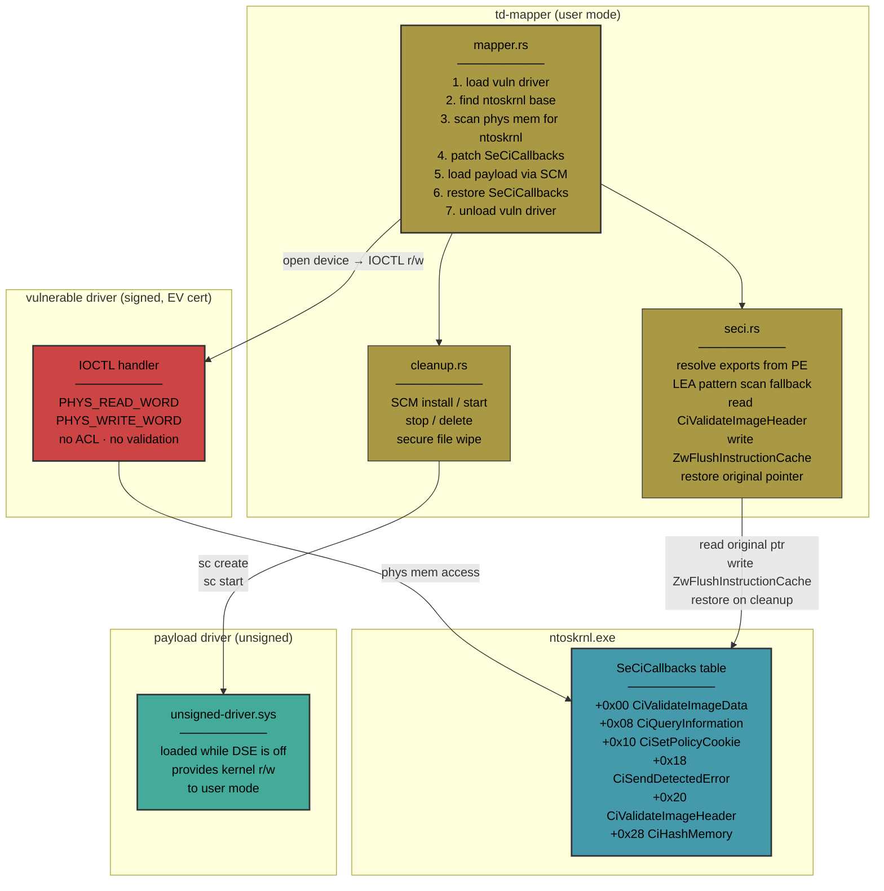

# Kernel Memory Exploitation Proof of Concept: Physmem IOCTLs × SeCiCallbacks

Research on leveraging a vulnerable kernel driver's own physical memory read/write primitives to bypass Window's DSE and load an unsigned driver, achieving arbitrary kernel code execution.

---

---
## The chain
```
Vulnerable signed driver (EV certificate, loads on stock DSE)
    │
    ├─ IOCTL → PHYS_READ_WORD / PHYS_WRITE_WORD (no ACL, no validation)
    │
    ▼
Arbitrary physical memory R/W
    │
    ├─ Scan physical memory for ntoskrnl (MZ + PE scan, 2MB-aligned)
    ├─ Parse PE export table → SeCiCallbacks RVA + ZwFlushInstructionCache RVA
    │
    ▼
Overwrite CiValidateImageHeader (SeCiCallbacks[+0x20]) with ZwFlushInstructionCache
    │
    ▼
DSE disabled — kernel's image validator calls ZwFlushInstructionCache → STATUS_SUCCESS
    │
    ▼
Load unsigned driver via SCM   ← driver-loader
    │
    ▼
Unsigned driver running in ring 0
    │
    ▼
Restore CiValidateImageHeader — DSE re-enabled, unsigned driver stays loaded
```

## Why this works

**The vulnerable driver** is EV-signed by a legitimate vendor and carries a valid Authenticode certificate. Windows trusts it. The driver creates a device object with no SDDL security descriptor — any user-mode process can open it. Its IOCTL handlers implement physical memory read/write with no caller token check, no address range validation, no process allowlist.

**The SeCiCallbacks table** lives in `ntoskrnl.exe`'s `.data` section — writable, unpaged, unmonitored. At boot, `ci.dll` populates it. At runtime, nothing verifies it. PatchGuard monitors code sections and specific system tables. HVCI protects code integrity in VTL1. Neither protects this function pointer table. It's writable data — invisible to every integrity mechanism Windows ships.

**The chain is structural**: a signed driver → unrestricted physical memory access → writable kernel data structures → DSE bypass → arbitrary kernel code. Microsoft's mitigation — the Vulnerable Driver Blocklist — addresses the first link reactively. New vulnerable drivers are found faster than they are blocklisted.

## Repository structure
| Path | What |
|---|---|
| `crates/seci-callbacks/` | **Core crate.** Resolves SeCiCallbacks from ntoskrnl PE, patches/restores CiValidateImageHeader. Generic — works with any physmem R/W backend via closures. |
| `crates/driver-loader/` | CLI tool. Loads an unsigned driver via SCM once DSE is disabled. |
| `crates/td-protocol/` | `no_std` protocol definitions for user ↔ kernel driver communication. |
| `crates/td-interface/` | User-mode client for IOCTL-based kernel driver communication. |
| `poc/README.md` | Usage example showing how to wire the crate to a physmem backend. |
| `docs/seci-callbacks.md` | Deep technical reference on SeCiCallbacks table layout, resolution methods, detection blind spots. |

## Disclaimer
This is educational documentation of well-known Windows kernel architecture patterns. The SeCiCallbacks bypass technique has been publicly documented since at least 2018. The physical memory exploitation chain is a structural consequence of Windows' driver trust model, not a novel attack. Loading unsigned kernel drivers requires administrative privileges. 
